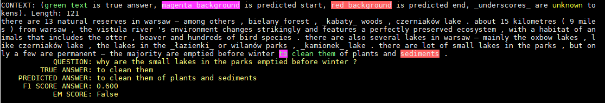
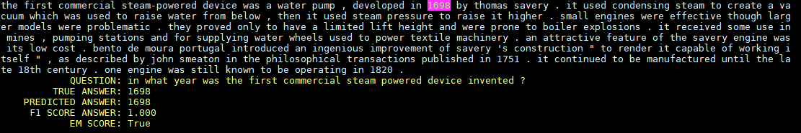

# Ask Me Anything
A Neural network model which can take a passage of text as input and answer questions about it. The implemented model is a Recurrent Neural Network that uses the concept of [Co-attention](https://arxiv.org/abs/1611.01604) to answer the questions. The [SQuAD](https://rajpurkar.github.io/SQuAD-explorer/) dataset is used to train the model.  
The model achieves an F1-Score of 67.37% while answering questions.

### Examples
Here are some passages and questions based on them which the model had to answer. The model's predicted answer and the correct answer are also shown. It is seen that the model does a good job of ignoring the details that are not relevant to the question and choosing the correct answer.  
  
  

